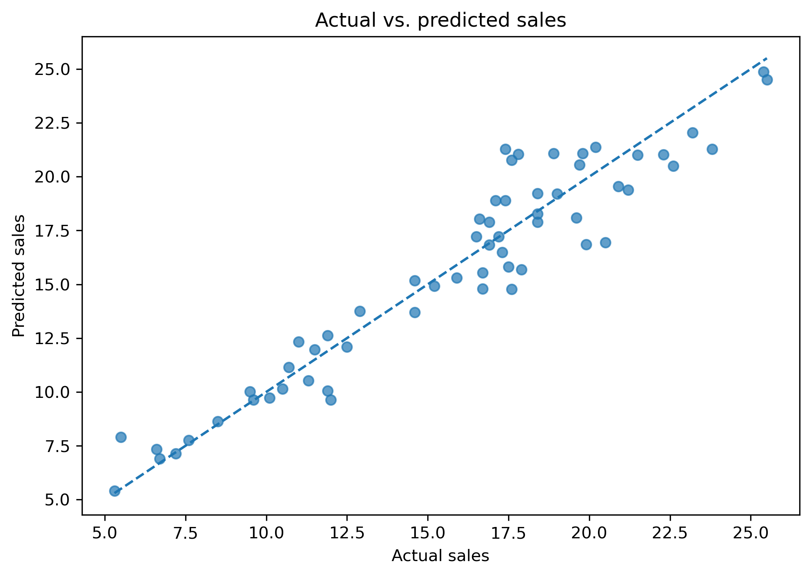

# Advertising sales prediction with multiple linear regression

This project applies multiple linear regression to analyze the relationship between advertising expenditures and product sales.

The analysis evaluates TV, radio, and newspaper advertising as potential predictors of sales. Statistical significance and backward feature selection are used to obtain a reduced regression model, while regression diagnostics are performed to assess the main assumptions of the model.

## Objective

The objective is to develop and evaluate a multiple linear regression model capable of predicting sales from advertising expenditures while retaining only statistically significant predictors.

The dataset is divided into 70% training data and 30% test data using a fixed random state of 1 for reproducibility.
## Methodology

The analysis follows these main steps:

1. Explore the advertising dataset and define Sales as the response variable.
2. Split the data into 70% training and 30% test sets.
3. Estimate a multiple linear regression model using ordinary least squares (OLS).
4. Evaluate the statistical significance of the regression coefficients.
5. Apply backward feature selection to remove non-significant predictors.
6. Estimate the final reduced model using TV and Radio.
7. Construct a 90% confidence interval for the mean sales response under a specified advertising scenario.
8. Evaluate regression assumptions using residual diagnostics, the Jarque–Bera test, Durbin–Watson statistic, VIF, and White test.
9. Manually verify skewness, excess kurtosis, Durbin–Watson, and the White test.
10. Evaluate the final model on the test set using R², MAE, and RMSE.

11. ## Results

Backward feature selection removed Newspaper because it was not statistically significant, leaving TV and Radio as predictors in the final regression model.

The final reduced model achieved the following performance on the test set:

- R²: 0.907
- MAE: 1.192
- RMSE: 1.538

For the specified advertising scenario, the final model estimated sales of approximately 15.22, with a 90% confidence interval for the mean response of approximately [14.72, 15.73].

Diagnostic analysis indicated no substantial first-order autocorrelation and no major multicollinearity between TV and Radio. However, the normality and homoscedasticity assumptions were not fully satisfied, so conventional inferential results should be interpreted with caution.

## Model performance

The following figure compares actual and predicted sales on the test set. Points closer to the diagonal reference line represent more accurate predictions.

## Tools and libraries

- Python
- NumPy
- pandas
- Matplotlib
- Seaborn
- SciPy
- Statsmodels
- scikit-learn

## Repository contents

- `advertising_multiple_linear_regression.ipynb` — Complete statistical analysis and regression modeling workflow.
- `Advertising.csv` — Dataset used for the analysis.
- `images/actual_vs_predicted_sales.png` — Test-set model performance visualization.
